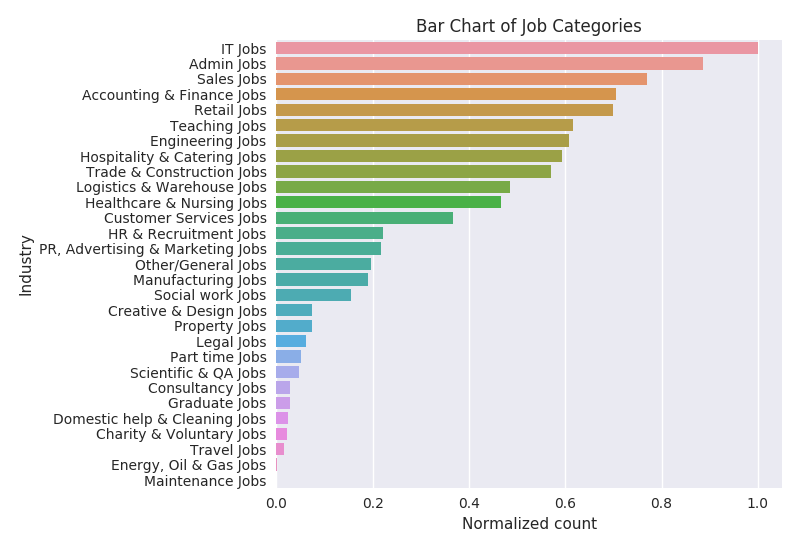
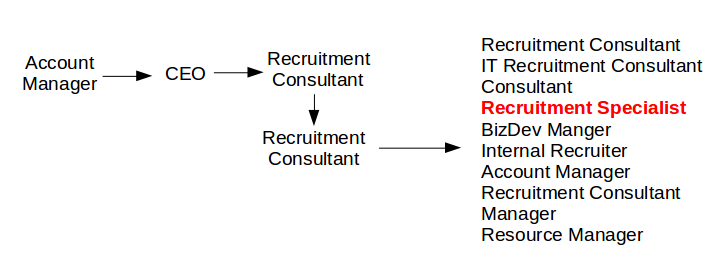

# Career Path Advice using Machine Learning

Code which predicts your next job title given your CV. A project for the UCL Machine Learning MSc. Dataset provided by Adzuna.

## Abstract

Every job site aims to present their users with a selection of highly relevant jobs. Currently on most job sites, candidates input a desired job title, and perhaps various other parameters, into a search box to return some relevant jobs. The main problem with this approach is that the candidate might not know what they want to do next or might want to be aware of other available options. A solution to this problem is to personalize any recommendations using the candidate's CV or LinkedIn profile. The current state-of-the-art paper in this area achieves strong results for two separate industries, finance and technology. Most job sites, however, cover many different industries. This work uses a comparable setup, a contextual LSTM, to train a single model which achieves similar results to the state-of-the-art but for a dataset broadly representative of the UK jobs market. Furthermore, the top job title recommendations for each candidate present a number of viable future career options. Both these attributes demonstrate its suitability for use on a job site.

## Overview of the data

A couple of visualizations of the dataset that was used:

## Recommendations made by the model

Below are a couple of sample career paths and the top 10 recommendations made by the model. The 'actual' next job title is shown in red.

## Description of files

* *embeddings* - folder that contains scripts which test the provided skill embeddings and learn the job embeddings
* *baseline_model.py* - script that runs and evaluates the baseline model, a Naive Bayes
* *ecoc.py* - runs the Error Correcting Output Codes' model
* *eda.py* - some exploratory data analysis
* *nemo.py* - script that runs and evaluates the main model, a contextual LSTM
* *prepare_data.py* - prepares data ready for the main model
* *read_data.py* - reading in the CVs and other bits of data
* *split_data.py* - script which performs a stratified split of the dataset

